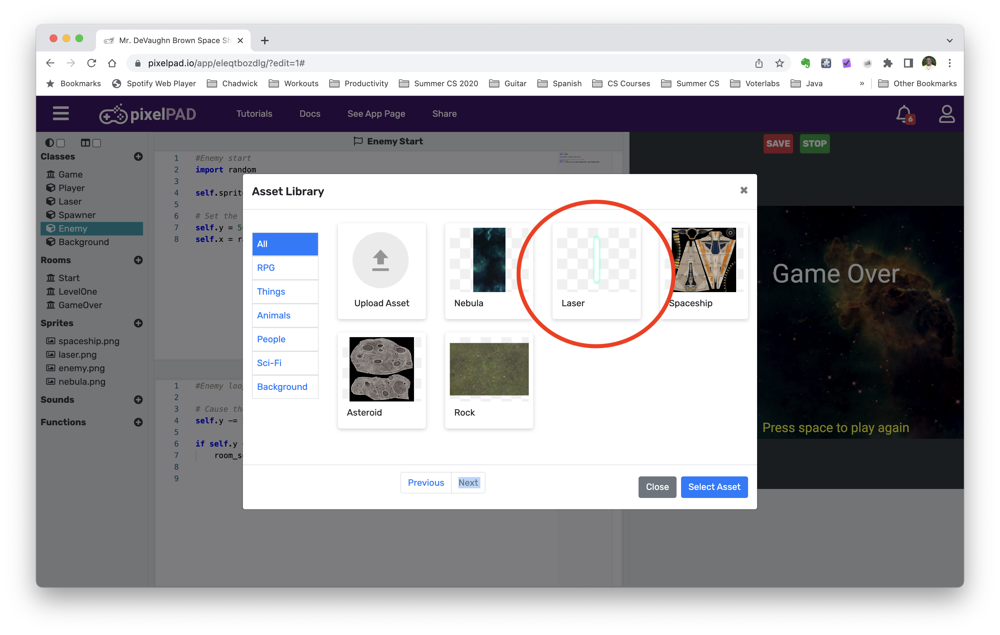
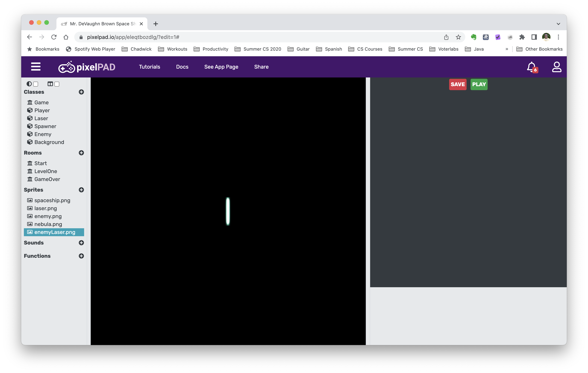

# Space Shooter Add-ons

## Step 1: Spinoff

Log in to your pixelpad account and go to the below link

https://pixelpad.io/app/eleqtbozdlg/

You'll see a screen like the one below. Click Spinoff and name your game "[Your Name] Advanced Space Shooter"

You'll then click your game

## Bonus 1: Having the enemies fire back

### Step 1: Choose Enemy Laser Image
We will first choose the enemy laser image. 

Click the + next to Sprites

Click next until you get to the last screen and choose the blue laser image

Name it `enemyLaser`

You should see something like this if you click on `enemyLaser.png` in the left pane:

### Step 2: Add the EnemyLaser Class

Click the + sign next to Classes

Name it `enemyLaser`

It should look like this:

### Step 3: Fill out EnemyLaser Class

### Step 4: Add Code to Enemy Class

### Step 5: Fix Laser Speed

You'll now see that the alien and the enemy go at the same speed and doesn't make the game more interesting. Let's fix the enemy laser speed.

### Step 6: Make it so the player can destroy enemy lasers

To make the game even more interesting, let's make it so that the player can destroy the enemy laser with their laser. 

Go to the `Laser` class and add this code

# Bonus 2: Adding Lives

### Step One: Add Heart Image

Go to sprites and add the heart image. Name it `heart`

## Step Two: Update Level One Code

Go to the `LevelOne` room and insert the following code

Go to the `Player` loop code and update it to be the following:

## Step Three Fix the code

You will notice that if you play, that you still instantly die. This is because when the laser or enemy hits you, it keeps hitting you until you die. We need to set it up so that the laser or enemy can only hit you once. 

Update your `LevelOne` loop code to the following:

